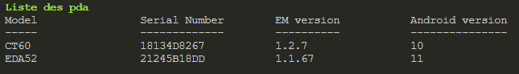
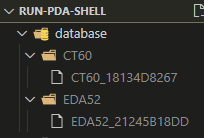
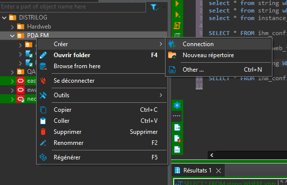
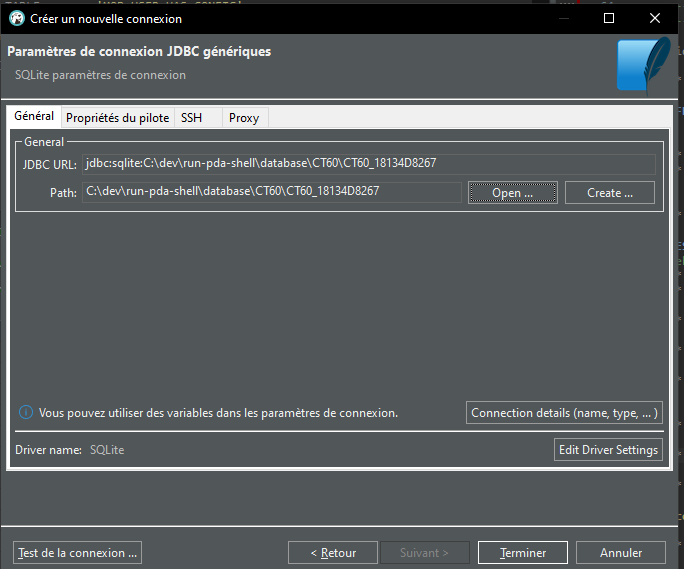
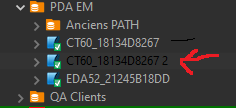
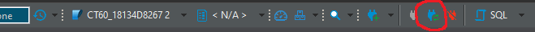

# RUN PDA SHELL

  

## Sommaire

- [Installation](#installation)

	- [Avec Tools-bash](#avec-tools-bash)

	- [Sans Tools-bash](#sans-tools-bash)

- [Liste des commandes](#liste-des-commandes)

	- [help](#help)

	- [list](#list)

	- [version](#version)

	- [default](#default)

	- [clear](#clear)

	- [uninstall](#uninstall)

	- [build](#build)

	- [export](#export)

- [Utilisation de la base de donnée exportée avec DBeaver](#utilisation-de-la-base-de-donnée-exportée-avec-dbeaver)

## Installation
Note : Un dossier nommé **database** est nécessaire à la racine du dossier, si il n'y est pas lors du clone, vous devez le créer manuellement afin que les bases de données puissent se stocker lors de l'exportation.
### Avec tools-bash
En ayant cloné au préalable de repository [Tools-bash](https://github.com/huiitre/tools-bash) et en l'ayant installé correctement, il vous suffit d'insérer cette ligne au début du fichier *cordova.js* afin d'importer la fonction run :
```bash
# todo Importation de la fonction RUN
source  "c:\dev\run-pda-shell\run.sh"
```
Veuillez à changer le chemin du script run pour que celui ci soit bien importé.

### Sans tools-bash
Pour utiliser la fonction nativement, il vous suffit de cloner le repository quelque part, puis de venir insérer dans votre fichier *.bashrc* le code suivant : 
```bash
if [ -f c:/run-pda-shell/tools.sh ]
then
	source c:/run-pda-shell/run.sh
fi
```
Bien penser à changer le chemin menant à votre script run.

## Liste des commandes
Note : La fonction *run* peut aussi être appelée en majuscule, pour le peu que vous ayez également importé l'alias (disponible à la fin du fichier *run.sh*) : 
```bash
# todo alias run to RUN
alias RUN='run'
```
### help
Commandes : 
```bash
run -h
run -H
run -help
run -HELP
```
Affiche la liste des commandes disponibles et une bref description de leur utilisation.
### list
Commandes : 
```bash
run -l
run -L
run -list
run -LIST
```
Affiche la liste des PDA actuellement branchés et détectés par ADB (nécessite son installation en global sur votre pc) en y renseignant le modèle, le numéro de série, la version EasyMobile et la version Android.



### version
Commandes : 
```bash
run -v
run -V
run -version
run -VERSION
```
Module en cours de développement, est censé afficher un versioning du script en y renseignant les différents changements apportés.
### default
Commandes : 
```bash
run -d
run -D
run -default
run -DEFAULT
```
Permet d'y indiquer un modèle de PDA par défaut. Cette information sera stocké ensuite dans un fichier *config.cfg* à la racine du dossier, sous la forme KEY=VALUE : 
```config
DEFAULT_PDA=eda52
```

Ce paramètre est ensuite utilisé dans chaque module qui nécessite de sélectionner un modèle de PDA.
### clear
Commandes : 
```bash
run -c
run -C
run -clear
run -CLEAR
```
Permet de clear le cache et les données de l'application EM du PDA sélectionné.
Relance également l'application.
### uninstall
Commandes : 
```bash
run -u
run -U
run -uninstall
run -UNINSTALL
```
Désinstalle l'application EM du PDA sélectionné.
### build
Commandes : 
```bash
run -b
run -B
run -build
run -BUILD
```
Permet de générer un build APK qu'il soit DEBUG ou RELEASE.
Ne nécessite pas de PDA de branché car il n'installe pas l'apk dans un PDA, il le compile seulement.
### export
Commandes : 
```bash
run -e
run -E
run -export
run -EXPORT
```

Note : Pour que l'export fonctionne, il est nécessaire d'avoir un dossier nommé *database* à la racine du projet, sinon les écritures ne pourront pas se faire. Veuillez donc bien à vérifier si ce dossier existe après le clone, si ce n'est pas le cas vous devrez le créer manuellement, le reste se fera tout seul.

Permet d'exporter la base de donnée de l'application EM du PDA sélectionné.
Le module va créer (si ce n'est pas déjà fait) un dossier du nom du modèle du PDA (exemple CT45, EDA52) et va ensuite y insérer le fichier BDD qui a été copié depuis le PDA, en le renomant sous cette forme : **MODELE_SERIALNUMBER**.

Ce qui permet d'avoir une base de donnée stockée en local PAR pda et non par modèle.



## Utilisation de la base de donnée exportée avec DBeaver
Le but du module d'export de base de donnée est multiple.

* Pouvoir exporter et < figer > la base de donnée d'un PDA, afin d'y extraire potentiellement des données.
* Pouvoir exporter une base afin de travailler dessus sans utiliser le devtools de chrome, qui pue ces grands mort il faut bien l'avouer.

Le fichier généré ne possède pas d'extensions de fichier, mais c'est un fichier SQLite, ce qui fait qu'on a la possibilité de l'importer dans n'importe quel logiciel de gestion de base de donnée (DBeaver, heidiSQL). Pour le cas de SQLDEVELOPPER, il sera nécessaire d'y installer un plugin afin de gérer la compatibilité avec SQLite.

On va gérer pour l'instant l'importation du fichier depuis le logiciel DBeaver.

1. Click droit dans le navigateur de BDD à gauche puis créer -> Connection.


2. Sélectionnez SQLite puis cliquez sur **Suivant** en bas de la fenêtre.

3. On clique sur **Open** et on va chercher notre fichier de BDD dans le dossier /database/...
Puis on clique sur **Terminer** en bas.


4. Notre base est créé et disponible dans le menu de gauche.


### Synchronisation et méthode de travail
Voici un schéma simple d'utilisation.

1. On exporte la base avec la commande *run -e* puis en sélectionnant le PDA.
2. Notre fichier est désormais stocké en local, on lance DBeaver et on double click sur la connexion afin de la lancer.

Note : Si DBeaver est déjà lancé et qu'on a déjà une connexion active avec la base, il est nécessaire de se déconnecter/reconnecter de la base. Vous pouvez cliquer sur le bouton *Rejeter/se reconnecter* dans le menu du haut.


La nouvelle base écrase la précédente en local mais DBeaver garde encore une trace de l'ancienne version de la base du PDA, il est donc nécessaire d'effectuer cette manipulation.